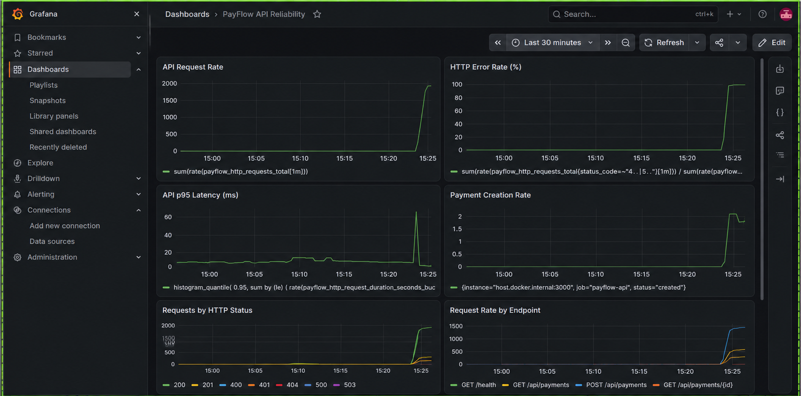

# PayFlow — Payment API Quality Engineering

[](https://github.com/YannickAtabong9/payflow-quality-engineering/actions/workflows/quality-gate.yml)

**Production-style quality engineering for a payment API — covering API automation, payment integrity, idempotency and concurrency, PostgreSQL validation, contract testing, security-focused QA, performance engineering, observability, and CI/CD quality gates.**

**38 Automated Tests** · **Playwright** · **TypeScript** · **PostgreSQL** · **OpenAPI** · **k6** · **Prometheus** · **Grafana** · **GitHub Actions**

---

## Overview

PayFlow is a production-style payment API built to demonstrate how quality engineering can be embedded throughout the software delivery lifecycle rather than treated as an end-stage testing activity.

The platform supports payment creation and retrieval, processing and completion, failed payment states, refunds, idempotency protection, concurrent request handling, PostgreSQL persistence, API rate limiting, and operational monitoring.

The project focuses particularly on problems that matter in payment systems: **transaction integrity, duplicate-payment prevention, valid state transitions, persistence correctness, API reliability, and controlled failure behavior.**

## Engineering Highlights

| Area                        | Implementation                                                        |
| --------------------------- | --------------------------------------------------------------------- |
| **API Automation**          | 38 automated Playwright API tests                                     |
| **Payment Integrity**       | Lifecycle, state-transition and refund validation                     |
| **Duplicate Protection**    | Idempotency-key and concurrent-request testing                        |
| **Database Validation**     | Direct PostgreSQL assertions                                          |
| **Contract Testing**        | OpenAPI validation with Swagger Parser and Ajv                        |
| **Security-Focused QA**     | Rate limiting, malformed payloads, malicious inputs and secure errors |
| **Performance Engineering** | k6 baseline/load testing up to 100 virtual users                      |
| **Observability**           | Prometheus metrics and Grafana reliability dashboard                  |
| **CI/CD**                   | Live GitHub Actions quality gate                                      |
| **Environment**             | Reproducible Docker/PostgreSQL setup                                  |

## System Architecture

```text
                    ┌─────────────────────┐
                    │  Playwright Tests   │
                    │    k6 Load Tests    │
                    └──────────┬──────────┘
                               │
                               ▼
                    ┌─────────────────────┐
                    │    PayFlow API      │
                    │ Fastify/TypeScript  │
                    └──────────┬──────────┘
                               │
                 ┌─────────────┴─────────────┐
                 ▼                           ▼
        ┌────────────────┐          ┌─────────────────┐
        │   PostgreSQL   │          │   Prometheus    │
        │ Payment State  │          │     Metrics     │
        └────────────────┘          └────────┬────────┘
                                            │
                                            ▼
                                   ┌─────────────────┐
                                   │     Grafana     │
                                   │   Dashboards    │
                                   └─────────────────┘
```

GitHub Actions provides the automated CI quality gate around the application, database initialization, and test suite.

## Quality Engineering Strategy

PayFlow uses a layered quality engineering approach rather than relying only on endpoint-level positive testing.

```text
                 Performance & Reliability
                         ▲
                         │
                 Security-Focused QA
                         ▲
                         │
              End-to-End Integration
                         ▲
                         │
               Database Validation
                         ▲
                         │
                 Contract Testing
                         ▲
                         │
                 API Automation
```

This allows failures to be detected across API behavior, contracts, persistent state, security controls, and runtime reliability.

## 1. Payment Lifecycle & State Integrity

PayFlow models a controlled payment lifecycle:

```text
pending
   │
   ▼
processing
   │
   ├────────► failed
   │
   ▼
successful
   │
   ▼
refunded
```

Automated tests validate both successful workflows and invalid state transitions, including:

* Payment creation in the expected initial state
* Processing pending payments
* Completing eligible payments
* Failed payment paths
* Successful refunds
* Invalid refund attempts
* Unsupported state transitions
* Persistent state after API operations

This ensures payment correctness is validated beyond HTTP responses and across the transaction lifecycle.

## 2. Idempotency & Concurrency Testing

Duplicate transaction prevention is one of the central engineering scenarios in PayFlow.

Payment creation requires an:

```http
Idempotency-Key
```

The automated suite verifies that:

* Repeated identical requests return the same payment
* Reusing an idempotency key with different payment data returns `409 Conflict`
* Concurrent identical requests create only one database record
* PostgreSQL provides persistence-level protection against duplicate idempotency keys

The payment model stores both:

```text
idempotency_key
request_hash
```

This allows PayFlow to distinguish legitimate retries from conflicting reuse of an existing idempotency key.

### Concurrent Request Validation

The test suite sends simultaneous identical payment requests and validates the resulting persistent state:

```text
Multiple concurrent requests
          │
          ▼
    Same Idempotency-Key
          │
          ▼
      PayFlow API
          │
          ▼
   One payment record
```

This validates race-condition and duplicate-transaction behavior that sequential API testing can miss.

## 3. API Functional Testing

The Playwright suite covers the core API workflow:

```http
GET  /health
GET  /health/db
GET  /metrics

POST /payments
GET  /payments/:id
POST /payments/:id/process
POST /payments/:id/complete
POST /payments/:id/refund
```

Coverage includes positive and negative scenarios, payment creation and retrieval, processing, completion, refunds, invalid identifiers, state transitions, input validation, and end-to-end payment flows.

Reusable API clients, test-data factories, and helpers keep the automation maintainable as coverage grows.

## 4. Database Validation

API responses alone do not prove that a payment system persisted the correct state.

PayFlow tests query PostgreSQL directly after selected API operations.

The payment model contains:

```text
id
reference
amount
currency
customer_email
status
created_at
idempotency_key
request_hash
```

Database assertions validate:

* Record creation
* Payment status and references
* Stored request data
* Idempotency persistence
* Duplicate-record prevention
* State changes following API operations

Database initialization is reproducible so the required schema can be created consistently in both local development and clean CI environments.

## 5. API Contract Testing

The API contract is defined using OpenAPI:

```text
tests/contract/openapi.yaml
```

Contract validation uses **Swagger Parser** and **Ajv**.

Tests validate the OpenAPI specification and verify actual API responses against the defined contract, providing an additional quality layer between implementation behavior and consumer expectations.

## 6. Security-Focused Quality Engineering

Security testing is incorporated into the automated quality strategy rather than isolated from normal API testing.

Coverage includes:

* API rate-limit enforcement
* Negative and zero amount validation
* Decimal amount rejection
* Type manipulation
* Unsupported currency validation
* Invalid email validation
* Malicious input handling
* Malformed JSON handling
* Secure error responses
* Prevention of database implementation-detail leakage
* Prevention of stack-trace exposure

### Rate Limiting

The `/payments` endpoint implements API rate limiting.

Automated tests deliberately exceed the configured threshold and verify:

```http
429 Too Many Requests
```

This validates both standard API behavior and abuse-control behavior.

## 7. Performance Engineering

Performance testing is implemented using **k6**.

```text
tests/performance/payment-creation.js
tests/performance/payment-load.js
```

The project includes baseline and load scenarios scaling traffic up to **100 virtual users**.

Configured performance thresholds include:

```text
HTTP error rate < 1%
p95 latency < 500 ms
p99 latency < 1000 ms
```

These thresholds convert performance expectations into measurable pass/fail criteria.

Detailed performance results are maintained in:

```text
tests/performance/performance-report.md
```

## 8. Observability & Reliability

PayFlow exposes Prometheus-compatible metrics through:

```http
GET /metrics
```

Custom metrics include:

```text
payflow_http_requests_total
payflow_http_request_duration_seconds
payflow_payments_created_total
```

Prometheus collects runtime metrics while Grafana provides visibility into:

* API request rate
* HTTP error rate
* p95 API latency
* Payment creation rate
* Requests by HTTP status
* Request rate by endpoint

### PayFlow API Reliability Dashboard



The dashboard helps correlate functional, integration, security, and performance testing with latency, errors, traffic patterns, and payment activity.

## 9. CI/CD Quality Gate

The **live GitHub Actions quality gate** automatically validates PayFlow when repository changes are introduced.

```text
Checkout Repository
        │
        ▼
Initialize Containers
        │
        ▼
Setup Node.js
        │
        ▼
Install Dependencies
        │
        ▼
Initialize PostgreSQL
        │
        ▼
Build TypeScript
        │
        ▼
Start PayFlow API
        │
        ▼
Wait for API Health
        │
        ▼
Run Automated Test Suite
        │
        ▼
     PASS / FAIL
```

A successful pipeline verifies that:

* The project initializes in a clean CI environment
* PostgreSQL starts and initializes successfully
* The TypeScript application builds
* The PayFlow API starts correctly
* The API reaches a healthy state
* The complete automated quality suite passes

When tests fail, CI uploads **Playwright reports and API logs as artifacts** to support investigation.

The current workflow status is displayed by the **PayFlow Quality Gate** badge at the top of this README and links directly to the GitHub Actions workflow.

## Automated Test Coverage

The current Playwright suite contains **38 automated tests** covering:

* API functional testing
* Positive and negative scenarios
* Payment lifecycle validation
* PostgreSQL persistence validation
* Idempotency
* Concurrent duplicate requests
* Refund workflows
* OpenAPI contract validation
* API rate limiting
* Input security testing
* Secure error handling
* End-to-end integration testing

## Tech Stack

| Category             | Technologies                           |
| -------------------- | -------------------------------------- |
| **Application**      | Node.js, TypeScript, Fastify, Zod      |
| **Database**         | PostgreSQL                             |
| **Automation**       | Playwright                             |
| **Contract Testing** | OpenAPI, Swagger Parser, Ajv           |
| **Performance**      | k6                                     |
| **Observability**    | Prometheus, Grafana, prom-client       |
| **DevOps**           | Docker, Docker Compose, GitHub Actions |

## Project Structure

```text
.
├── .github/
│   └── workflows/
│       └── quality-gate.yml
├── docs/
│   └── screenshots/
│       └── grafana-payflow-dashboard.png
├── monitoring/
│   └── prometheus/
│       └── prometheus.yml
├── src/
│   ├── config/
│   ├── routes/
│   ├── schemas/
│   ├── types/
│   └── server.ts
├── tests/
│   ├── api/
│   ├── clients/
│   ├── contract/
│   ├── factories/
│   ├── helpers/
│   ├── integration/
│   ├── performance/
│   └── security/
├── docker-compose.yml
├── package.json
├── playwright.config.ts
└── tsconfig.json
```

## Running PayFlow Locally

### Prerequisites

* Node.js
* Docker
* Docker Compose
* k6 — required only for performance testing

### 1. Clone the Repository

```bash
git clone https://github.com/YannickAtabong9/payflow-quality-engineering.git
cd payflow-quality-engineering
```

### 2. Install Dependencies

```bash
npm install
```

### 3. Start Infrastructure

```bash
docker compose up -d
```

### 4. Initialize PostgreSQL

```bash
npm run db:init
```

### 5. Start PayFlow

```bash
npm run dev
```

The API runs at:

```text
http://127.0.0.1:3000
```

### 6. Run the Automated Test Suite

```bash
npm test
```

### 7. View the Playwright HTML Report

```bash
npx playwright show-report
```

## Running Performance Tests

Baseline:

```bash
k6 run tests/performance/payment-creation.js
```

Load test:

```bash
k6 run tests/performance/payment-load.js
```

## Monitoring

When the monitoring stack is running:

```text
PayFlow API   http://localhost:3000
Prometheus    http://localhost:9090
Grafana       http://localhost:3001
```

## What This Project Demonstrates

PayFlow demonstrates practical experience with:

* API-first test automation
* Payment transaction integrity testing
* Playwright API automation architecture
* Idempotency and concurrency testing
* PostgreSQL state validation
* API contract testing
* Security-focused QA
* Performance engineering
* Prometheus-based observability
* Grafana reliability dashboards
* Reproducible Docker environments
* CI/CD quality gates
* Automated failure artifact collection

## Author

**Atabong Yannick Nanchan**

Senior QA Engineer · Quality Engineering · Test Automation · API & Payment Systems · Application Security

[GitHub](https://github.com/YannickAtabong9) · [LinkedIn](https://www.linkedin.com/in/yannick-atabong-6bb426200/)
